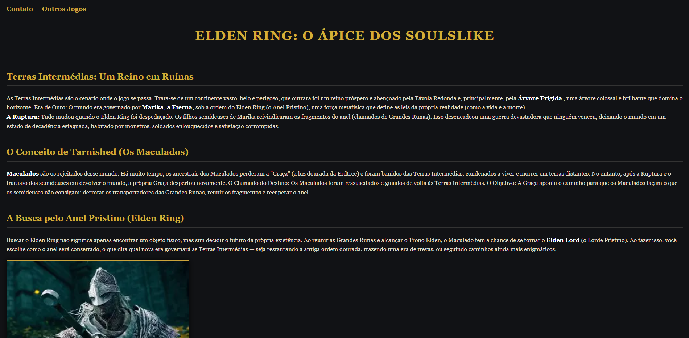

🔗 **Acesse o site rodando ao vivo aqui:** [Portal Elden Ring](https://gabrielchagasdev.github.io/elden-ring-page/)

# Portal Soulslike - Elden Ring ⚔️

Uma página web temática desenvolvida para centralizar informações essenciais sobre o universo de *Elden Ring*, explorando a lore, conceitos fundamentais do jogo e a jornada dos Maculados.

## 🗒️ Sobre o Projeto

O objetivo deste projeto foi construir uma interface simples e imersiva que apresenta os pilares da história do jogo de forma clara e organizada. A página aborda:
* *Terras Intermédias:* O contexto do reino em ruínas e o impacto da Ruptura.
* *O Conceito de Tarnished:* A explicação sobre os Maculados e o chamado da Graça.
* *A Busca pelo Anel Pristino:* O objetivo final da jornada para se tornar o Elden Lord.

## 🛠️ Tecnologias Utilizadas

* *HTML5:* Estruturação semântica de todo o conteúdo de texto e seções de lore.
* *CSS3:* Estilização customizada utilizando uma paleta de cores escura com acentos em dourado para refletir a identidade visual do jogo, além de navegação superior (Contato e Outros Jogos).

## 🚀 Como Visualizar

Como o projeto é construído com tecnologias front-end estáticas, você pode visualizar diretamente abrindo o arquivo principal:
1. Faça o download ou clone este repositório.
2. Abra o arquivo index.html em qualquer navegador web.
